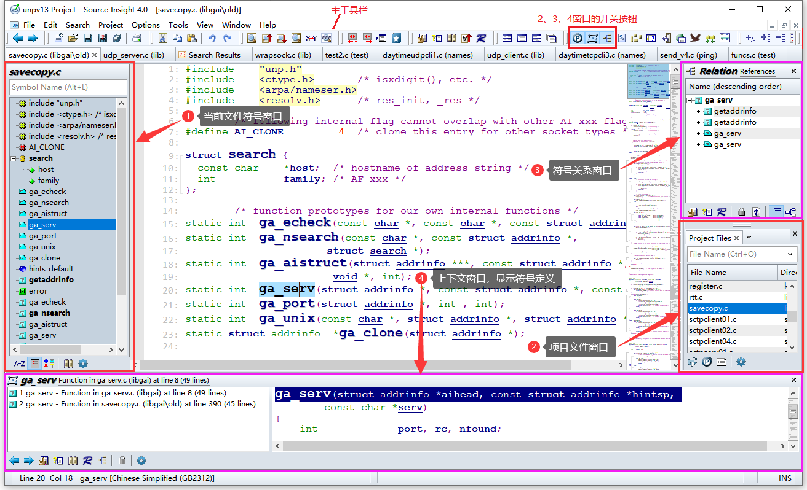
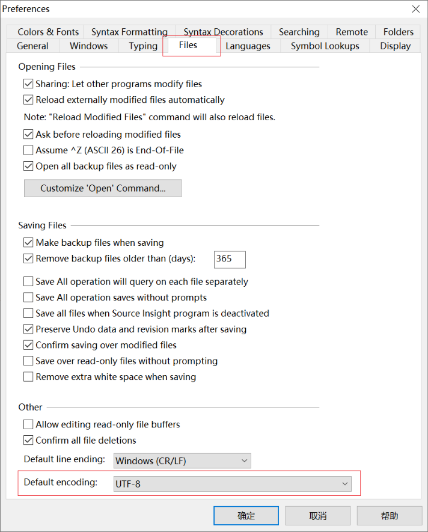

# source insight使用笔记




## 一、环境搭建

### 工具安装
安装必备工具软件，傻瓜式一键下一步

1. sshfs-win: <https://github.com/billziss-gh/sshfs-win/releases>
2. SSHFS-Win Manager: <https://github.com/evsar3/sshfs-win-manager/releases>
3. source insight 4.0

### sshfs挂载


使能挂载点，在`我的电脑`可以访问目录

## 二、source insight使用

### 2.1 显示空字符

```text
View -> Visible Tabs and Spaces
```


### 2.2 切换主题

```text
Options -> Visual Theme -> Light Blue
```


### 2.3 关闭 Fixed Whitespace 功能

避免空格显示异常，建议关闭

```text
Options --> Style Properties，Fixed Whitespace 选择OFF，点击Done
```


### 2.4 修改默认编码

```text
Option -> Preference -> Files，修改编码
```




### 2.5 修改字体

```text
Option -> File Type Options -> Screen Font
```

推荐 **DejaVu Sans Mono 9**


### 2.6 格式化代码

```text
Tools -> Reformat Source Code Options 修改为K&R 类型格式化
```


注意：K&R 比较接近 linux kernel 编码风格，但实际效果一般，最好用内核工具检查一遍。手动修正所有 error!

```shell
./scripts/checkpatch.pl -f security/yama/yama.c
```

### 2.7 显示右边界线

```text
Option -> File Type Options -> Show right margin
```


---